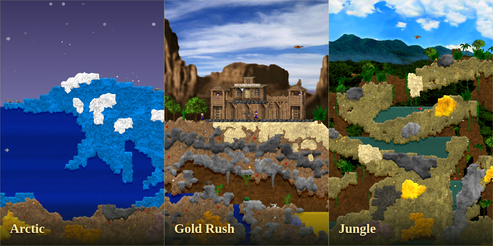

# Project Neoclonk

**Play Clonk Rage in the browser.**

> Unofficial, noncommercial browser adaptation of [Clonk Rage and Clonk Planet](https://www.clonk.de/) © RedWolf Design / Matthes Bender and contributors. Original content: [CC BY-NC 4.0](https://creativecommons.org/licenses/by-nc/4.0/); engine: [ISC](cr_source/licenses/clonk_source_license.txt). Browser code and presentation are modified. “Clonk” is a registered trademark of Matthes Bender; no endorsement is implied. Provided **as-is, without warranties**, to the extent permitted by law. See [licenses and attribution](#licenses-and-attribution) before redistributing.



*Arctic · Gold Rush · Jungle — original-engine gameplay screenshots, cropped and arranged for this collage. Original artwork © RedWolf Design / Matthes Bender and contributors, CC BY-NC 4.0.*

**[Play Neoclonk](https://christophmark.github.io/neoclonk/)**

Neoclonk runs **Clonk Rage 4.9.10.7 [330]** and **Clonk Planet 4.65** through separate C++ engines compiled to WebAssembly. Each uses its own original scenario scripts, sprites, materials and sound. Gameplay runs on your device; only the selected engine loads.

## Playing

- **133 official scenarios**: 80 from Rage and its Knights, Far Worlds, Fantasy and Western add-ons, plus 53 from Planet. Separate galleries identify each game. Rage tiles show gameplay captures; Planet tiles retain the original scenario artwork. Packs download as needed.
- **Solo exploration** is available through **Play solo** for multiplayer scenarios, including Jungle. Original rules and goals remain in place; some need opponents or finish immediately. Choose **Continue this round** after an early victory to keep exploring. **Host** starts the normal multiplayer lobby.
- **Every mission is available immediately.** Puzzles, objectives and progress within each mission follow the original scripts.
- **Classic nine-button controls**, with transparent touch controls on mobile. Touch buttons sit above the game's action icons, and the camera accounts for the space they cover.
- **Planet Hazard inventory:** tap **Inventory** (keyboard **V**) to cycle carried items and **Info** (**F**) for item details. **Throw** fires the selected weapon; double **Stop**, then **Throw**, drops it. Some ammunition packs open with double **Dig**.
- **Responsive, full-viewport play** with compact **− / + zoom buttons**. Whole-number enlargement keeps source pixels uniform; ½× and ¼× steps provide wider views. New games default to 2×, and saved fractional settings snap to the nearest step.
- **Local saves** in the original `.c4s` format. Choose **Load saved game** on the start screen to continue. The header's **Exit** button and scenario switching offer to save a solo round before leaving; a failed save keeps the round open.
- **Help** and **Multiplayer lobby** are available at the top of the start screen.

Saved games and player files are stored in that browser's IndexedDB. They are not uploaded to the lobby or shared automatically between devices; clearing browser storage removes them.

## Multiplayer

Each player joins from their own browser or device. Public rooms and private room codes are available through the lobby. The host's browser runs the room and must stay open.

Players connect directly through WebRTC where possible. If a direct connection fails, an expiring TURN relay connection forwards encrypted packets. Game simulation stays on the players' devices; the lobby handles discovery and connection setup, with no lobby requests during gameplay.

To run your own discovery and relay service, see [the lobby service documentation](lobby-service/README.md) and configure its public endpoint in `rage-port/shell/discovery-config.js`. Manual invitation/reply exchange is also available under **Advanced** when discovery is unconfigured.

### Compatibility and limitations

- Live multiplayer saves, reconnect and host migration are not supported. Background browser throttling may slow a room. Shared-keyboard and split-screen multiplayer are not supported.
- Rage supports WAV sound effects and Vorbis music through Web Audio; Planet supports its original wave sound effects. MIDI-only music tracks are silent in both browser ports.
- Planet uses a modern Linux platform adaptation of its original engine. Exact parity with the original Windows executable has not been established. WebGL 2 is required for Planet.
- Community collections without clear redistribution terms are not bundled. Their presence in a public contest archive does not establish permission for this distribution. See the [content policy](docs/PLANET_CONTENT.md).
- The original artwork retains its original resolution. Pixel-aligned enlargement avoids uneven scaling but cannot add detail absent from the original sprites.

## Run locally

A Python HTTP server is enough to run the included standalone game:

```sh
python3 -m http.server 3000 --bind 0.0.0.0 --directory web/public
```

Open `http://localhost:3000/rage/`. On the same Wi-Fi, use the host computer's LAN address and port 3000.

For the React website, use Node **22.13 or later**:

```sh
cd web
npm ci
npm run dev -- --host 0.0.0.0 --port 3000
```

See [GitHub Pages hosting](docs/GITHUB_PAGES.md) for static deployment.

## Build the engine

Install Python 3, Node and Emscripten **3.1.74** at `.toolchains/emsdk`:

```sh
git clone https://github.com/emscripten-core/emsdk.git .toolchains/emsdk
.toolchains/emsdk/emsdk install 3.1.74
.toolchains/emsdk/emsdk activate 3.1.74
python3 rage-port/deps/build-openssl.py
python3 rage-port/scripts/build.py --jobs 4
python3 rage-port/scripts/install-web.py
python3 rage-port/scripts/install-library.py
python3 planet-port/scripts/prepare.py
python3 planet-port/scripts/build.py --jobs 4
python3 planet-port/scripts/install.py
```

`rage-port/source/` contains the browser engine, and `cr_source/` contains the original ISC source and bundled library notices. Browser modifications are recorded in `rage-port/patches/original-to-browser.patch`. Build scripts pin the OpenSSL input hash and adapt the pinned SDK for the original SDL/GL compatibility layer. Toolchains and intermediate build products are not included.

Planet source, its pinned upstream revision, browser patch and build instructions are documented in [planet-port/README.md](planet-port/README.md). The official Planet group files and their checksums are included under `planet-content/`.

All 19 original Rage catalog group files are included under `original-content/release/cr_game_linux/` and `original-content/addons/release/`. `install-library.py` verifies their hashes. Supplemental packs load separately as needed. Publisher archive URLs and hashes are recorded in the provenance manifests; native executables are not included.

### Regenerate the scenario catalog

Install Pillow and unpack the included groups into fresh inspection directories:

```sh
python3 -m pip install Pillow
node tools/import-content.mjs original-content/release/cr_game_linux original-content/import
node tools/import-content.mjs original-content/addons/release original-content/addons/import/all
python3 rage-port/catalog/build-catalog.py
python3 rage-port/scripts/install-library.py
```

The importer requires a fresh destination. Catalog generation preserves download provenance and existing screenshot fields. Running the included build does not require extraction.

## Repository layout

| Directory | Contents |
| --- | --- |
| `web/` | Website source and runnable engine/assets in `public/rage/` |
| `rage-port/` | Rage engine port, shared browser menu, catalog, build scripts and tests |
| `planet-port/` | Separate Planet engine, browser shell, build adapters and tests |
| `planet-content/` | Permitted Planet groups, public catalog and provenance |
| `lobby-service/` | Discovery/signaling service, Redis storage, TURN credentials and deployment bundle |
| `cr_source/` | Original engine source and library notices |
| `original-content/` | Original game packs, licenses and provenance |
| `docs/` | Gameplay audit, engine and hosting documentation |
| `native-reference/` | Native-engine comparison scripts and reports |

## Test coverage

The [80-scenario integration report](web/public/rage/source/scenario-library-acceptance.json) covers startup, normal controls, a short simulation interval, gameplay screenshots and solo saves where available. All 27 scenarios listed for two or more players are covered by actual two-browser rooms. This does not establish completion of every objective or campaign puzzle, or coverage of every device, network and long-running round.

Additional checks cover:

- [Solo startup for multiplayer scenarios](web/public/rage/source/solo-scenarios-chromium.json), including [Jungle in WebKit](web/public/rage/source/solo-scenarios-webkit.json). These checks cover one-player startup, original controls and a short simulation interval.
- [Original-engine replay parity](web/public/rage/source/native-replay-verification.json) through frame 680 of a Gold Mine recording.
- [Chromium ↔ WebKit multiplayer](web/public/rage/source/rtc-cross-browser.json), including player input, synchronized state, terrain agreement and shared pause.
- [Direct and TURN-relayed multiplayer on the deployed service](web/public/rage/source/discovery-live.json).
- Save persistence in [Chromium](web/public/rage/source/native-exit-persistence.json) and [WebKit](web/public/rage/source/native-exit-persistence-webkit.json), plus [touch access to native menus](web/public/rage/source/touch-menus.json).

Planet checks cover official scenario startup and controls, mobile zoom and touch input, save/reload through the shared menu, and original control synchronization across two browser instances. These short checks do not prove completion of every goal or performance on every phone. See [Planet validation](planet-content/validation/README.md).

Browser test scripts are in `rage-port/tests/`, `planet-port/tests/` and `web/tests/`. Gameplay screenshot sources and capture details are recorded in the [catalog provenance](web/public/rage/source/scenario-screenshot-provenance.json) and [README collage provenance](docs/images/scenarios.provenance.json).

## Licenses and attribution

**Engine code:** Planet’s pinned Linux adaptation is credited to [Teero888 and contributors](https://github.com/Teero888/clonk_planet); its ISC notice and embedded third-party notices are preserved in `planet-port/`. The original Clonk source uses the **[ISC license](cr_source/licenses/clonk_source_license.txt)**. Preserve its copyright notices. Browser platform, rendering, input, filesystem/audio adapters, responsive viewport, menus, gallery and build tooling are modifications to the original project. Bundled libraries retain their own licenses; see source notices and `web/public/rage/licenses/`.

**Original game content:** graphics, audio, scenario/object scripts and text are by **RedWolf Design / Matthes Bender and the credited original contributors**, under **[Creative Commons Attribution–NonCommercial 4.0](https://creativecommons.org/licenses/by-nc/4.0/)**. Content is not covered by the engine's ISC license. This distribution and browser adaptation are noncommercial; commercial reuse requires separate permission. Preserve the [original content license](original-content/licenses/clonk_content_license.txt), original credits in the packs and asset provenance manifests.

**Clonk trademark:** Clonk is a registered trademark of Matthes Bender. The [original trademark license](original-content/licenses/clonk_trademark_license.txt) applies. Neoclonk is an unofficial adaptation and is not endorsed by the original authors.

**Adaptations:** original scenario and object packs remain unchanged. The browser menu/layout, responsive presentation, background/icon treatment, gameplay captures and cropped screenshot collage are adaptations; their underlying original artwork remains subject to the content license. Public availability does not waive noncommercial content restrictions or other applicable license terms.

**Warranty:** provided as-is, without warranties, to the extent permitted by law.
